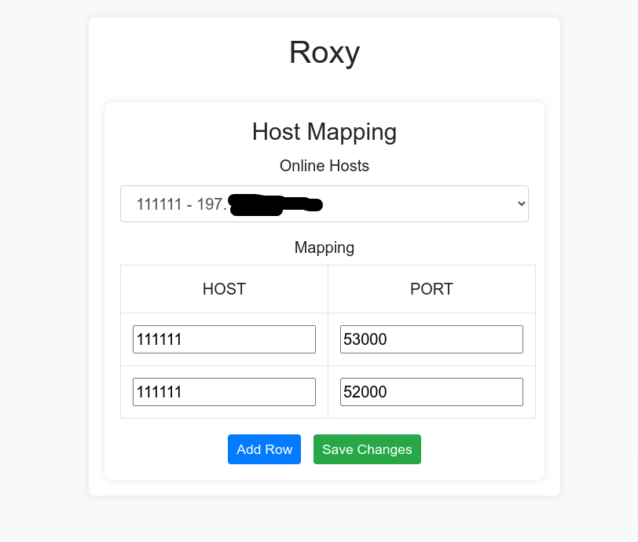

# Roxy

Simply install Roxy on your server, and it can redirect traffic to any device anywhere on earth!

## Why Roxy?
I created this to be able to route all my traffic for my personal apps and vpn to my servers at home. Because it is annoying seeing my home IP changing always. \
\
I own a very cheap VPS and a domain name, with Roxy i can just forward ports and use my domain name instead of catching what's my house's IP today.

#### Reinventing the wheel
I am aware of all the possible solutions for this problem out there but hey! it is fun to recreate your world and learn more.

## How it works
Roxy will listen to the ports listed in `PORTS` file. \
When a connection is made it is forwarded to the correspondent host with that port. \
example 1: \
`[MYPHONE] ---port 80--> [ROXY INSTALLED ON VPS] --port 80-> [MY HOMES SERVERS] ` \
example 2: \
`[MYPHONE] ---port 2222--> [ROXY INSTALLED ON VPS] --port 2222-> [MY HOMES SERVERS] `

## Set up

To set up the whole system there are two parts.
(there will be singleton binaries soon on github package section)

#### Part I - Server setup:
1 - Create a file called `PORTS`  \
2 - Run Roxy on your server, techincally the main binary. 
* `./main_forwarder_process your_local_ip secret_pin1-secret_pin2... unlock_pass `
 Knowing that: 
* arg n1: your local ip
* arg n2: list of `secret_pins` that identifies the hosts (secret pin should be exactly `6` chars seperated by `-` if multiple)
* arg n3: the password for the dashboard webpage

#### Part II - Bot setup: 

Run the bot executable on your target host, the bot will periodically send its `secret_pin` to the server claiming that is is online, so Roxy can determine its IP address.

* `./bot yourserverip secretPin refreshRateInSec`
Knowing that:
* `yourserverip` is the server ip where Roxy is installed.
* `secretPin` is the Identifier of the host for Roxy.
* `refreshRateInSec` is how many seconds the bot takes to send a heartbeat to the server.

## Configuration

1 - To Configure ports forwarding head to `your-server-ip:3150/home`
and set the pin to unlock the dashboard. 

The pin is set in the arguments by you when you first launched `main_forwarder_process`.

2 - In this panel you will be able to see which hosts are online by checking their IP and also you are able to forward ports.

- ports are forwarded as soon as you save changes.
- port forward can be removed by simply clearing the text fields of the row mapping and saving changes.